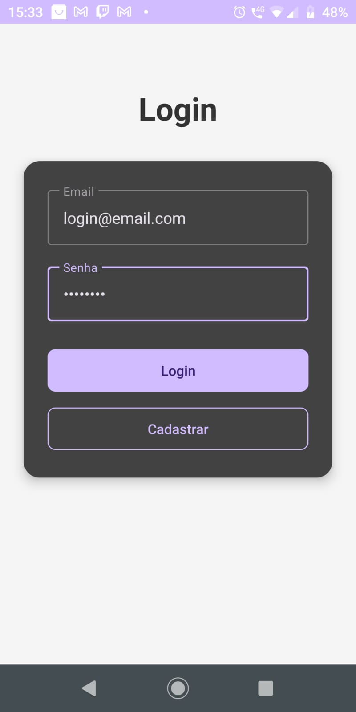

# 🔐 Firebase Login App

A simple and modern Android application implementing **Firebase Authentication (Email & Password)**.  
Built with **Kotlin**, **AndroidX**, **ViewBinding**, and **Firebase Authentication**.

---

## ✨ Features

- 📝 **User Registration** with email and password  
- 🔑 **User Login**  
- 👋 **Custom Home Screen** with welcome message  
- 🚪 **Logout** and redirection to the login screen  
- 🔥 Integrated with **Firebase Authentication**  

---

## 🖼️ App Screenshots

### 📌 Main Screen (Login / Registration)


---

### 🎉 Home Screen (Welcome)


---

## 🛠️ Technologies Used

- [Kotlin](https://kotlinlang.org/)  
- [AndroidX](https://developer.android.com/jetpack/androidx)  
- [Firebase Authentication](https://firebase.google.com/docs/auth)  
- [Material Design Components](https://m3.material.io/)  

---

## 🚀 Getting Started

1. Clone the repository:  
   ```bash
   git clone https://github.com/adrprates/login-firebase.git
